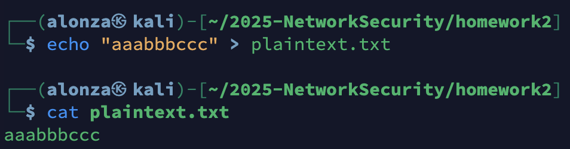
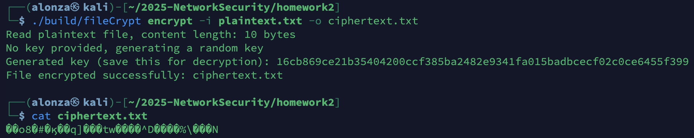

# Homework 2

## Build

```bash
cd homework2
make
```

## Encrypt

```bash
./build/fileCrypt -i <inputFile> -o <outFile>
```

## Decrypt

```bash
./build/fileCrypt -i <inputFile> -o <outFile> -k <key>
```

## Description

- Encryption

    - Validates the input file exists and reads its bytes into memory.
    - Uses AES-256 in GCM (AEAD) mode for confidentiality and integrity.
    - Key handling:
        - If no key is provided, generates a random 32-byte key with crypto/rand and prints it as 64 hex characters. Save this key for decryption.
        - If a key is provided, it must be 64 hex characters (32 bytes).
    - Generates a fresh random nonce of size gcm.NonceSize() for every encryption.
    - Produces output as nonce || ciphertext (the nonce is prefixed to the ciphertext bytes).
    - Writes the result to the specified output file and logs helpful messages.

- Decryption

    - Validates the ciphertext file exists and requires a key (64 hex characters).
    - Reads the file bytes and splits them into: nonce = first gcm.NonceSize() bytes, ciphertext = remaining bytes.
    - Reconstructs AES-256-GCM with the provided key and decrypts with gcm.Open, which also verifies authenticity.
    - Decryption fails if the key, nonce, or data is invalid/tampered (authentication error).
    - Writes the recovered plaintext to the specified output file and logs helpful messages.

## Demo

1. Prepare a plaintext.txt

    

2. Encrypt as ciphertext.txt

    

3. Decrypt from ciphertxt.txt as newPlaintext.txt

    
