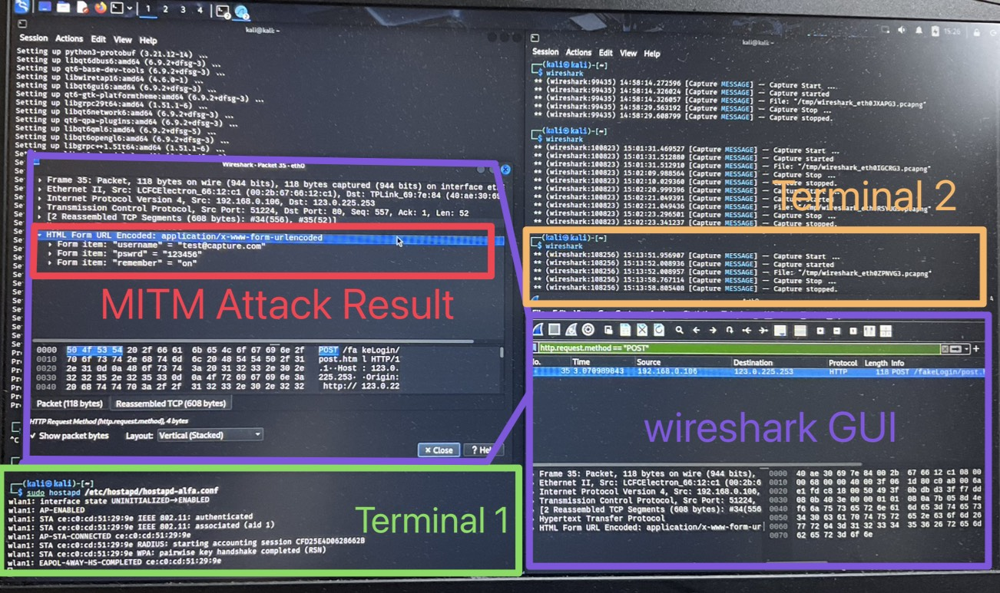

# Homework 7

## Table of contents
- [USE LiveUSB](#use-liveusb)
    - [Hardare](#hardare)
    - [Set And Open LiveUSB](#set-and-open-liveusb)

- [Task1: Shadow IT](#task1-shadow-it)
    - [Step](#step)
    - [Result](#result-task1)

- [Task2: Fake AP and MITM Attack](#task2-fake-ap-and-mitm-attack)
    - [Set hostapd](#set-hostapd)
    - [Set DHCP](#set-dhcp)
    - [MITM Attack](#mitm-attack)
    - [Result](#result-task2)

- [Contribution Table](#contribution-table) 

## USE LiveUSB

### Hardare
- ALFA AWUS036ACM (MediaTek MT7610U/MT7612U)

### Set And Open LiveUSB
- download [download kali-linux-2025.3-live-amd64.iso](https://www.kali.org/get-kali/#kali-live)
- use [download rufus-4.11.exe](https://rufus.ie/zh_TW/) store kali-linux in USB
- open host BIOS 
    - BOOT ->  BOOT Order
        - find [XXX flash] 
        - F6 move to top
        - F10 save
- ativate kali linux on host
- check network connection


## Task1: Shadow IT

### Step

1: Check interface names and status
```
ip a || iwconfig (e.g., wlan0、1)
```


2: Terminate all processes that may interfere with aircrack-ng
```
sudo airmon-ng check kill
```

3: Enable monitor mode on the interface
```
sudo airmon-ng start <interface_name> (e.g., wlan1)
```


4: Verify that the monitor interface is successfully enabled
```
iwconfig
```


5: Perform wireless network scanning
```
sudo airodump-ng wlan1mon
```


6: Stop monitor mode and restart services
```
sudo airmon-ng stop wlan1mon 
sudo service NetworkManager start 
sudo airmon-ng check kill 
```

### Result <a id="result-task1"></a>


## Task2: Fake AP and MITM Attack

Prerequisites

* Ensure you have an active internet connection.
* When you run the wihotspot command in the terminal, it calls the hostapd service underneath to create the hotspot.
* If hostapd fails to start or cannot properly configure your wireless adapter, your phone will show “Unable to join”.
* We will bypass the wihotspot GUI and directly create a minimal hostapd configuration to force AP mode to start in the simplest way.

### Set hostapd:

1: Stop all network services and clean environment
```
sudo service NetworkManager stop
sudo killall wpa_supplicant
```
2: Assign an IP address to the ALFA wireless adapter
```
sudo ifconfig wlan1 192.168.10.1 netmask 255.255.255.0 up
```
3: Create the hostapd configuration file
```
sudo nano /etc/hostapd/hostapd-alfa.conf
```
4: Write the following configuration:
```
interface=wlan1
driver=nl80211
ssid=Group2
channel=6
hw_mode=g
wpa=2
wpa_passphrase=12345678
wpa_key_mgmt=WPA-PSK
rsn_pairwise=CCMP
```
> (In nano: press Ctrl+O to save, Enter to confirm, Ctrl+X to exit)

5: Try starting hostapd directly
```
sudo hostapd /etc/hostapd/hostapd-alfa.conf
```
> The wireless hotspot has been successfully created, but it does not assign IP addresses to connected devices, so we will use DHCP to provide IP configuration next.

### Set DHCP:
1: Install dnsmasq
```
sudo apt install dnsmasq
```
2: Configure IP forwarding and NAT
```
sudo sysctl -w net.ipv4.ip_forward=1
```
3: Clear all old iptables rules:
```
sudo iptables --flush
sudo iptables --table nat --flush
sudo iptables --delete-chain
sudo iptables --table nat --delete-chain
```
4: Set NAT rules (forward wlan1 traffic through eth0)
```
sudo iptables -t nat -A POSTROUTING -o eth0 -j MASQUERADE
sudo iptables -A FORWARD -i wlan1 -o eth0 -j ACCEPT
sudo iptables -A FORWARD -i eth0 -o wlan1 -m state --state RELATED,ESTABLISHED -j ACCEPT
```
5: Configure dnsmasq (DHCP & DNS)
```
sudo nano /etc/dnsmasq.conf
```
6. Write the following
```
interface=wlan1
dhcp-range=192.168.10.50,192.168.10.150,12h
```
> (In nano: press Ctrl+O to save, Enter to confirm, Ctrl+X to exit)

7: Start dnsmasq
```
sudo service dnsmasq start
```
### Set MiTM attack Tool
```
sudo apt install wireshark
```

### MITM Attack

#### Open two terminals:
- Terminal 1: Start the AP
    ```
    sudo hostapd /etc/hostapd/hostapd-alfa.conf
    ```
- Terminal 2: Start Wireshark for MiTM preparation
    ```
    wireshark
    ```
    > In Kali Linux Wireshark GUI, click "**Capture**" to begin capturing packets.
    > 
#### Connect another device to the AP:
* WiFi Name: Group02
* Password: 12345678
> Join the AP using any mobile device (e.g iphone15 ).
> Custom WiFi Name & Password

#### Visit the simulated login page:
````
http://123.0.225.253/fakeLogin/
````
* Enter:
    * email: test@capture.com
    * password: 123456
    * Click login.
    * If Error: 501 appears, ignore it.

#### Stop the packet capture and extract POST data
In Wireshark GUI, click the red square button to stop capturing.
* Apply filter:
```
http.request.method == "POST"
```

### Result <a id="result-task2"></a>


## Contribution Table

| Student ID | Works | Percentage |
| - | - | - |
| 314581015 | Set And Open LiveUSB            | 20% |
| 313581047 | Set hostapd                     | 20% |
| 313581038 | Task1: Shadow IT                | 20% |
| 313581055 | Set DHCP & Set MiTM attack Tool | 20% |
| 412581005 | Task1,Task2 Result              | 20% |
