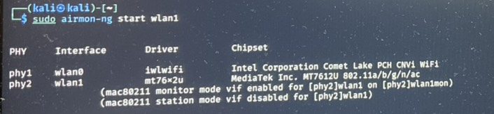
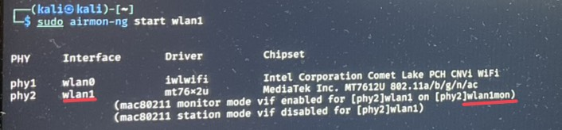
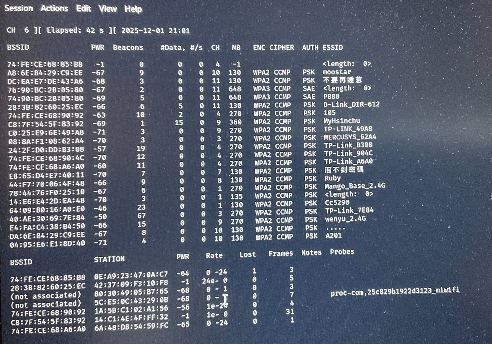

# Homework 7

## method LiveUSB
- [download kali-linux-2025.3-live-amd64.iso](https://www.kali.org/get-kali/#kali-live)
- [download rufus-4.11.exe](https://rufus.ie/zh_TW/)

## hardare
- ALFA AWUS036ACM (MediaTek MT7610U/MT7612U)

## Set & Open LiveUSB
- download kali-linux-2025.3-live-amd64.iso
- use rufus.exe store kali-linux in USB
- open host BIOS 
    - BOOT ->  BOOT Order
        - find [XXX flash] 
        - F6 move to top
        - F10 save
- ativate kali linux on host
- check network connection

## Shadow IT

### Step:

1. Check interface names and status
    ```
    ip a || iwconfig
    ```
    

2. Terminate all processes that may interfere with aircrack-ng
    ```
    sudo airmon-ng check kill
    ```
3. Enable monitor mode on the interface
    ```
    sudo airmon-ng start <interface_name> (e.g., wlan1)
    ```
    
4. Verify that the monitor interface is successfully enabled
    ```
    iwconfig
    ```
    
5. Perform wireless network scanning
    ```
    sudo airodump-ng wlan1mon
    ```
    
6. Stop monitor mode and restart services
    ```
    sudo airmon-ng stop wlan1mon 
    sudo service NetworkManager start 
    sudo airmon-ng check kill 
    ```
    
### result:
  


## Fake AP and MITM Attack
