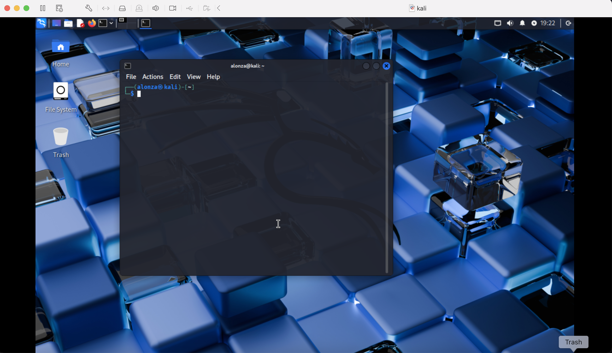
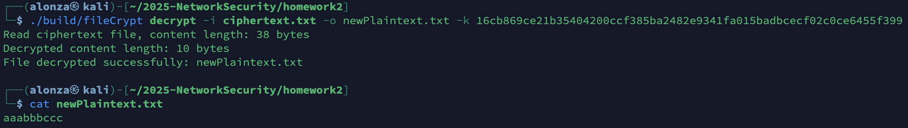

# 2025 Network Security Midterm Report

- [Homework 1 -  Kali Linux and NYCU Security Policy](#homework-1----kali-linux-and-nycu-security-policy)
- [Homework 2 - Encrypt and Decrypt A File](#homework-2---encrypt-and-decrypt-a-file)

    - [Build](#build)
    - [Encrypt](#encrypt)
    - [Decrypt](#decrypt)
    - [Description](#description)
    - [Feature](#feature)
    - [Demo](#demo)
    - [HW2 Contribution Table](#hw2-contribution-table)

- [Homework 3 - Design a Pasword Scheme](#homework-3---design-a-pasword-scheme)

    - [Password Scheme: Image Steganography](#password-scheme-image-steganography)
    - [HW3 Contribution Table](#hw3-contribution-table)

- [Homework 4 - Password Recovery](#homework-4---password-recovery)

    - [Password Dicts](#password-dicts)
    - [P3HTTP](#p3http)
    - [P3Secure](#p3secure)
    - [P3SSH](#p3ssh)
    - [P3Windows](#p3windows)
    - [HW4 Contribution Table](#hw4-contribution-table)

- [Homework 5 - CIS-CAT Report](#homework-5---cis-cat-report)

    - [1 Initial Setup](#1-initial-setup)

        - [1.1.1.1 Ensure cramfs kernel module is not available](#1111-ensure-cramfs-kernel-module-is-not-available)
        - [1.1.1.2 Ensure freevxfs kernel module is not available](#1112-ensure-freevxfs-kernel-module-is-not-available)
        - [1.1.1.3 Ensure hfs kernel module is not available](#1113-ensure-hfs-kernel-module-is-not-available)
        - [1.1.1.4 Ensure hfsplus kernel module is not available](#1114-ensure-hfsplus-kernel-module-is-not-available)

    - [2 Services](#2-services)

        - [2.1.13 Ensure rsync services are not in use](#2113-ensure-rsync-services-are-not-in-use)
        - [2.2.4 Ensure telnet client is not installed](#224-ensure-telnet-client-is-not-installed)
        - [2.2.6 Ensure ftp client is not installed](#226-ensure-ftp-client-is-not-installed)
        - [2.3.2.1 Ensure systemd-timesyncd configured with authorized timeserver](#2321-ensure-systemd-timesyncd-configured-with-authorized-timeserver)

    - [3 Network](#3-network)

        - [3.3.1 Ensure ip forwarding is disabled](#331-ensure-ip-forwarding-is-disabled)
        - [3.3.2 Ensure packet redirect sending is disabled](#332-ensure-packet-redirect-sending-is-disabled)
        - [3.3.5 Ensure icmp redirects are not accepted](#335-ensure-icmp-redirects-are-not-accepted)
        - [3.3.11 Ensure ipv6 router advertisements are not accepted](#3311-ensure-ipv6-router-advertisements-are-not-accepted)

    - [4 Host Based Firewall](#4-host-based-firewall)

        - [4.2.4 Ensure ufw service is enabled](#424-ensure-ufw-service-is-enabled)
        - [4.2.5 Ensure ufw loopback traffic is configured](#425-ensure-ufw-loopback-traffic-is-configured)
        - [4.2.7 Ensure ufw firewall rules exist for all open ports](#427-ensure-ufw-firewall-rules-exist-for-all-open-ports)
        - [4.2.8 Ensure ufw default deny firewall policy](#428-ensure-ufw-default-deny-firewall-policy)

    - [5 Access Control](#5-access-control)

        - [5.1.7 Ensure sshd ClientAliveInterval and ClientAliveCountMax are configured](#517-ensure-sshd-clientaliveinterval-and-clientalivecountmax-are-configured)
        - [5.1.13 Ensure sshd LoginGraceTime is configured](#5113-ensure-sshd-logingracetime-is-configured)
        - [5.1.15 Ensure sshd MACs are configured](#5115-ensure-sshd-macs-are-configured)
        - [5.1.16 Ensure sshd MaxAuthTries is configured](#5116-ensure-sshd-maxauthtries-is-configured)

    - [HW5 Contribution Table](#hw5-contribution-table)

## Homework 1 -  Kali Linux and NYCU Security Policy

In this homework, we installed a Kali Linux system, and learn how to configure VM with virtual box for windows users and VMware for Mac users, like this:



## Homework 2 - Encrypt and Decrypt A File

In thie homework, we learned how to use crypto package to encrypt and decrypt files.

Code is at: [homework2 directory](../homework2/).

### Build

```bash
cd homework2
make
```

### Encrypt

```bash
./build/fileCrypt encrypt -i <inputFile> -o <outFile> [-k <64-hex-key>]
```

### Decrypt

```bash
./build/fileCrypt decrypt -i <inputFile> -o <outFile> -k <64-hex-key>
```

### Description

- Encryption

    - Validates the input file exists and reads its bytes into memory.
    - Uses AES-256 in GCM (AEAD) mode for confidentiality and integrity.
    - Key handling:
        - If no key is provided, generates a random 32-byte key with crypto/rand and prints it as 64 hex characters. Save this key for decryption.
        - If a key is provided, it must be 64 hex characters (32 bytes).
    - Generates a fresh random nonce of size gcm.NonceSize() for every encryption.
    - Produces output as nonce || ciphertext (the nonce is prefixed to the ciphertext bytes).
    - Writes the result to the specified output file and logs helpful messages.

- Decryption

    - Validates the ciphertext file exists and requires a key (64 hex characters).
    - Reads the file bytes and splits them into: nonce = first gcm.NonceSize() bytes, ciphertext = remaining bytes.
    - Reconstructs AES-256-GCM with the provided key and decrypts with gcm.Open, which also verifies authenticity.
    - Decryption fails if the key, nonce, or data is invalid/tampered (authentication error).
    - Writes the recovered plaintext to the specified output file and logs helpful messages.

### Feature

- AES-256 key (32 bytes) for symmetric encryption
- GCM mode (AEAD) for confidentiality and integrity (auth tag included)
- Random per-file nonce, prefixed to output for stateless decryption
- Optional random key generation when no key is provided (printed as hex)
- Simple CLI with input/output paths and hex key handling

### Demo

1. Prepare a plaintext.txt

    

2. Encrypt as ciphertext.txt

    

3. Decrypt from ciphertext.txt as newPlaintext.txt

    

### HW2 Contribution Table

| Student ID | Works | Percentage |
| - | - | - |
| 314581015 | Code section & Readme document | 20% |
| 313581047 | Code section & Github repo establishment | 20% |
| 313581038 | Execution & Build test | 20% |
| 313581055 | Execute procedure | 20% |
| 412581005 | Kali env setup & Kali usage help | 20% |

## Homework 3 - Design a Pasword Scheme

In this homework, our team designed a creative password scheme: Image Steganography.

### Password Scheme: Image Steganography

1. Concept

    This scheme uses **image steganography** to hide a randomly generated login code inside an image, which acts as the user’s “password card.”

    During registration, the system embeds the code into the image, and the user saves it.

    During login, the user uploads the image, the system extracts the code, and verifies it for authentication.

2. How it works?

    - Registration:

        - The system generates a random login token (password) for each user.
        - The token is optionally encrypted and embedded into a user-provided or system-generated image (PNG or JPEG).
        - Then, the user downloads and save this image.

    - Login

        - The user uploads the image.
        - The system extracts the token and compares it with stored hash.
        - If the comparison succeeds, authentication is granted.

    - Storage

        - The server stores only the hash of the token or image fingerprint, not the plaintext token, reducing leakage risk.

3. Security and Usability Analysis

    | Perspective | Security | Usability |
    | - | - | - |
    | System | Does not store plaintext password; only hashes or fingerprints are stored, reducing leakage risk. | Requires additional program to embed/extract the token from the image. |
    | User | Image is hard to guess, more secure than plain text passwords. | No need to remember complex passwords; must safely keep the image. |
    | Attacker | Without the image, login is impossible; pairing with PIN or periodic updates mitigates leaked image risks. | If the image leaks and no other protection is applied, it may be misused. |

4. Protection Against Image Leakage

    As with traditional passwords, leaked images can be misused. This scheme adds simple protective measures to reduce the risk:

    - **Two-factor authentication**: Require a PIN or gesture in addition to the image.
    - **Periodic updates**: System generates new images regularly; old images expire.
    - **Hash verification**: The server only stores image fingerprints to prevent direct misuse if the database leaks.

5. Conclusion

    This scheme hides the “password” within an image, making it intuitive and portable for users while being more creative than traditional text passwords.

    Although image leakage cannot be completely prevented, combining PINs, periodic updates, and server-side protections significantly reduces potential misuse.

### HW3 Contribution Table

| Student ID | Works | Percentage |
| - | - | - |
| 314581015 | register login procedure | 20% |
| 313581047 | image steganography idea | 20% |
| 313581038 | security and usability analysis | 20% |
| 313581055 | advanced protection of image leakage | 20% |
| 412581005 | storage precedure | 20% |

## Homework 4 - Password Recovery

In this homework, we experienced hash cracking. We used not only Kali's internal tools but also wrote some small programs to crack the hashes.

Code is at: [homework4 directory](../homework4/).

### Password Dicts

- [rockyou.txt](https://github.com/brannondorsey/naive-hashcat/releases/download/data/rockyou.txt)
- [weakpass_4.txt](https://weakpass.com/download)

### P3HTTP

- ApacheMD5

    | User | Hash | Cracked | Method |
    | - | - | - | - |
    | admin | $apr1$GToZ6eNr$wn/MOgnx/f4Y0diEa7BNa1 | KKKKKKK | rockyou |
    | tomcat | $apr1$no3kBUxm$pk411ceCDJpW2oNs0WB3U0 | tivoli | rockyou |
    | xampp | $apr1$8WlYVzJL$C8ZhuDziOtni3HFtvKzGe0 | backupexec | weakpass_4 |
    | server_admin | $apr1$y758YD1Y$R1lKrNG6SKSjd0Nmb3v5U1 | SQLSQLSQLSQL | weakpass_4 |
    | demo | $apr1$JwOVMfoS$zMOzDn/xOMZ3VuEQO6IIj/ | microsoft | rockyou |
    | QCC | $apr1$IKjpEtXZ$UsaHuXDT3z8OZaHtBab0X. | iforget | rockyou |
    | cxsdk | $apr1$zMVw.RLi$kzXVI2SkGcgmioh1/R71L1 | electric | rockyou |
    | ovwebusr | $apr1$rOLMqcAU$DiIw.q5MBQOHDsgtE7k7u. | 77777777 | rockyou |
    | role1 | $apr1$.MLLcn6R$izw9nnviyDmEO3t0lrBpB0 | sestosant | weakpass_4 |
    | j2deployer | $apr1$qfumuNjF$sH4FzC3E7yHoPjj2PTU5I1 | pantiled | weakpass_4 |

### P3Secure

- MD5

    | Hash | Password | Method |
    | - | - | - |
    | e49201c3a8f548902b9ae9f16638f879 | 0890003871 | rockyou |
    | 19cf9dda4107b300d3218702df95c76d | nailz07 | rockyou |
    | c6281df39e8ade06c6cc9e0095fd5c0f | rksmbffs | rockyou |
    | a54034981409ed58d584dc9051853ddb | hidalgo212 | rockyou |
    | f58291f81868320f11235d9b9d416115 | aq12wsxz | rockyou |
    | ce1c96461fbb2ad92fffcafafe85d0d1 | CAROLIAN | [Hashes.com](https://hashes.com/zh/decrypt/hash) |
    | c6177167ebb2c37352c3a63f6fa0c39d | 19821983 | rockyou |
    | 5993428babd2cb253834e06de1800916 | netopia | rockyou |
    | bebc51b6f0bbd5da67950200a89026f6 | Autumn2018 | [Hashes.com](https://hashes.com/zh/decrypt/hash) |
    | 456c5a41af2eb09ac0ba0eb64f614887 | eeyore | rockyou |

- SHA3-256

    | Hash | Password | Method |
    | - | - | - |
    | 1074f17769cc2dfc0d65f713a7d8c4fd97fc78c69cfa13263b07b0e40b3cf83a | sweetlove |  rockyou |
    | 94f72dc2ea6bfae657b0ee3d5adb992aa669f6c4141717344e24e873dc09be04 | shunkoko | rockyou |
    | 19c743dc300d52fc93b5ee8c6d224f3beb8a05079e6439855cdae7e55bf16ef0 | mrzdale08 | rockyou |
    | 20e5b0556c431db9a147c3f73a0ae03d12f5ef391d277cd59ff0f2dd98198ec5 | minot24601 | rockyou |
    | a44cf105063b06bbb160c22058e9c3137c8ef424ae72f981d73b10fdc743026f | loverboydj242 | rockyou |
    | 74151544815c4a0153c2e7dfabcfd066d510d6996148d6c02f246c9c497bd15c | bear1194 | rockyou |
    | 745af7302284f80ddadf6893f64e247334aa899bfe90512a59aa41ea2863f56a | | |
    | 9d34ebe967a790ada61cfa2b4e16671bfb18f0ff59296f24a0eec20dacc5ece3 | | |
    | 0ecd9ac47c8e4b059c2b97db9657f80f203454ac8fcb01976e1decdb30af2510 | bambam | rockyou |
    | 3b2918324171f88304baee77d71cc0abd40e12f16f9a22404736000f00a7c7b6 | maddie1 | rockyou |

### P3SSH

attack.waynechiu.cc:3022

- SHA512

    |User | Password | Method |
    | - | - | - |
    | postfix | password | rockyou |
    | oracle | whatever | rockyou |
    | webmaster| | |
    | tcpdump | | |
    | linaro | | |
    | hplip | love12 | rockyou |
    | unscd | !@#$%^& | rockyou |
    | zabbix | vassiliki | rockyou |
    | omsagent | | |
    | xpdb | | |

### P3Windows

attack.waynechiu.cc:3089

- CMD

    ```bash
    impacket-secretsdump -sam SAM -system SYSTEM LOCAL
    gunzip -c /usr/share/wordlists/rockyou.txt.gz > /tmp/rockyou.txt
    ```

    ```bash
    john full_hashes.txt --format=NT --wordlist=/tmp/rockyou.txt
    john full_hashes.txt --format=NT --wordlist=/usr/share/set/src/fasttrack/wordlist.txt
    john full_hashes.txt --format=NT --wordlist=/usr/share/metasploit-framework/data/wordlists/default_pass_for_services_unhash.txt
    john full_hashes.txt --format=NT --show
    ```

| User | Password | Dict |
| - | - | - |
| Administrator | 123123123 | rockyou |
| Guest | (no-pwd) | rockyou |
| DefaultAccount | (no-pwd) | rockyou |
| WDAGUtilityAccount | | |
| db2admin | Manager | rockyou |
| sa | sqlsqlsqlsql | fasttrack/wordlist |
| owner | init1234 | rockyou |
| secure | | |
| admin | trinity | rockyou |
| demo | | |
| IEUser | personales | |
| nmt | ironport | metasploit-framework/data/wordlists/default_pass_for_services_unhash |
| user | | |
| john | trabajador | |

### HW4 Contribution Table

| Student ID | Works | Percentage |
| - | - | - |
| 314581015 | hash cracking & hashes validate | 20% |
| 313581047 | golang coding & multi-routine architecture | 20% |
| 313581038 | hash cracking & test file writing | 20% |
| 313581055 | hash cracking & cracking idea checking & report writing | 20% |
| 412581005 | hash cracking & kali using guide | 20% |

## Homework 5 - CIS-CAT Report

In this homework, we used the CIS-CAT tool to generate a system report and analyzed the failed outputs to understand security issues.

### 1 Initial Setup

#### 1.1.1.1 Ensure cramfs kernel module is not available

**Analysis:**

**Why OS left default configurations:**

- **Legacy Compatibility**: cramfs is an older, compressed read-only filesystem, historically used in embedded systems or boot images where space was extremely limited
- **Specific Use Cases**: Might have been included for niche applications requiring a highly compressed, immutable filesystem
- **Minimal Overhead**: Its read-only nature and compression offered benefits for specific, resource-constrained environments
- **Ease-of-Use**: Pre-installed kernel module support for various filesystem types without manual configuration

**Security Issues:**

- **Unnecessary Attack Surface**: If cramfs is not actively used, having its kernel module available increases the system's attack surface
- **Potential Vulnerabilities**: As an older and less actively maintained filesystem, cramfs might contain undiscovered vulnerabilities that could be exploited
- **Kernel Exploitation**: A vulnerability in the cramfs module could potentially lead to kernel-level exploits, compromising the entire system
- **Compliance violations**: Many security standards require disabling unused kernel modules to reduce attack surface

**Remediation Solutions:**

1. **Unload the cramfs kernel module**:

    ```bash
    # Unload cramfs module if currently loaded
    modprobe -r cramfs 2>/dev/null
    rmmod cramfs 2>/dev/null
    ```

2. **Disable cramfs kernel module permanently**:

    ```bash
    # Prevent cramfs from being loaded by making any attempt to install it fail
    printf '\n%s\n' "install cramfs /bin/false" >> /etc/modprobe.d/cramfs.conf
    
    # Blacklist cramfs to prevent automatic loading
    printf '\n%s\n' "blacklist cramfs" >> /etc/modprobe.d/cramfs.conf
    
    # Update initramfs to ensure changes persist across reboots
    update-initramfs -u
    ```

3. **Verify configuration**:

    ```bash
    # Check if cramfs module is loaded
    lsmod | grep cramfs
    
    # Verify modprobe configuration
    cat /etc/modprobe.d/cramfs.conf
    ```

**Impact on Users:**

- **Positive**: Reduces attack surface, improves system security, prevents potential kernel exploits
- **Negative**: Disables cramfs functionality (rarely used in modern systems), may break specific embedded applications
- **Minimal disruption**: For typical desktop/workstation systems, no impact on normal operations

**Security vs User Friendliness Balance:**

The optimal approach is **disable unless specifically required**:

- **Primary action**: Disable cramfs kernel module on general-purpose systems
- **Exception handling**: Enable only when cramfs is explicitly needed for specific applications
- **Documentation**: Clearly document when and why cramfs should be enabled
- **Monitoring**: Implement alerts for unauthorized kernel module loading

This approach prioritizes security by reducing the attack surface while maintaining functionality for systems that legitimately require cramfs support.

#### 1.1.1.2 Ensure freevxfs kernel module is not available

**Analysis:**

**Why OS left default configurations:**

- **Legacy Compatibility**: freevxfs is a free version of the Veritas filesystem, historically used for HP-UX operating systems compatibility
- **Cross-platform Support**: Included to support filesystem interoperability between different Unix-like systems
- **Specific Use Cases**: Might have been included for enterprise environments requiring HP-UX filesystem access
- **Ease-of-Use**: Pre-installed kernel module support for various filesystem types without manual configuration

**Security Issues:**

- **Unnecessary Attack Surface**: If freevxfs is not actively used, having its kernel module available increases the system's attack surface
- **Potential Vulnerabilities**: As a less commonly used filesystem, freevxfs might contain undiscovered vulnerabilities that could be exploited
- **Kernel Exploitation**: A vulnerability in the freevxfs module could potentially lead to kernel-level exploits, compromising the entire system
- **Compliance violations**: Many security standards require disabling unused kernel modules to reduce attack surface

**Remediation Solutions:**

1. **Unload the freevxfs kernel module**:

    ```bash
    # Unload freevxfs module if currently loaded
    modprobe -r freevxfs 2>/dev/null
    rmmod freevxfs 2>/dev/null
    ```

2. **Disable freevxfs kernel module permanently**:

    ```bash
    # Prevent freevxfs from being loaded by making any attempt to install it fail
    printf '\n%s\n' "install freevxfs /bin/false" >> /etc/modprobe.d/freevxfs.conf
    
    # Blacklist freevxfs to prevent automatic loading
    printf '\n%s\n' "blacklist freevxfs" >> /etc/modprobe.d/freevxfs.conf
    
    # Update initramfs to ensure changes persist across reboots
    update-initramfs -u
    ```

3. **Verify configuration**:

    ```bash
    # Check if freevxfs module is loaded
    lsmod | grep freevxfs
    
    # Verify modprobe configuration
    cat /etc/modprobe.d/freevxfs.conf
    ```

**Impact on Users:**

- **Positive**: Reduces attack surface, improves system security, prevents potential kernel exploits
- **Negative**: Disables freevxfs functionality (rarely used in modern Linux systems), may break HP-UX filesystem access
- **Minimal disruption**: For typical desktop/workstation systems, no impact on normal operations

**Security vs User Friendliness Balance:**

The optimal approach is **disable unless specifically required**:

- **Primary action**: Disable freevxfs kernel module on general-purpose systems
- **Exception handling**: Enable only when freevxfs is explicitly needed for HP-UX compatibility
- **Documentation**: Clearly document when and why freevxfs should be enabled
- **Monitoring**: Implement alerts for unauthorized kernel module loading

This approach prioritizes security by reducing the attack surface while maintaining functionality for systems that legitimately require freevxfs support for HP-UX filesystem access.

#### 1.1.1.3 Ensure hfs kernel module is not available

**Analysis:**

**Why OS left default configurations:**

- **Cross-platform Compatibility**: HFS (Hierarchical File System) is used to mount Mac OS filesystems, enabling interoperability between Linux and macOS systems
- **Data Migration Support**: Included to support users migrating data from Mac systems or accessing Mac-formatted storage devices
- **Specific Use Cases**: Might have been included for enterprise environments requiring Mac filesystem access
- **Ease-of-Use**: Pre-installed kernel module support for various filesystem types without manual configuration

**Security Issues:**

- **Unnecessary Attack Surface**: If HFS is not actively used, having its kernel module available increases the system's attack surface
- **Potential Vulnerabilities**: As a less commonly used filesystem in Linux environments, HFS might contain undiscovered vulnerabilities that could be exploited
- **Kernel Exploitation**: A vulnerability in the HFS module could potentially lead to kernel-level exploits, compromising the entire system
- **Compliance violations**: Many security standards require disabling unused kernel modules to reduce attack surface

**Remediation Solutions:**

1. **Unload the HFS kernel module**:

    ```bash
    # Unload HFS module if currently loaded
    modprobe -r hfs 2>/dev/null
    rmmod hfs 2>/dev/null
    ```

2. **Disable HFS kernel module permanently**:

    ```bash
    # Prevent HFS from being loaded by making any attempt to install it fail
    printf '\n%s\n' "install hfs /bin/false" >> /etc/modprobe.d/hfs.conf
    
    # Blacklist HFS to prevent automatic loading
    printf '\n%s\n' "blacklist hfs" >> /etc/modprobe.d/hfs.conf
    
    # Update initramfs to ensure changes persist across reboots
    update-initramfs -u
    ```

3. **Verify configuration**:

    ```bash
    # Check if HFS module is loaded
    lsmod | grep hfs
    
    # Verify modprobe configuration
    cat /etc/modprobe.d/hfs.conf
    ```

**Impact on Users:**

- **Positive**: Reduces attack surface, improves system security, prevents potential kernel exploits
- **Negative**: Disables HFS functionality, may break Mac filesystem access and data migration capabilities
- **Minimal disruption**: For typical desktop/workstation systems without Mac interaction, no impact on normal operations

**Security vs User Friendliness Balance:**

The optimal approach is **disable unless specifically required**:

- **Primary action**: Disable HFS kernel module on general-purpose systems
- **Exception handling**: Enable only when HFS is explicitly needed for Mac filesystem access
- **Documentation**: Clearly document when and why HFS should be enabled
- **Monitoring**: Implement alerts for unauthorized kernel module loading

This approach prioritizes security by reducing the attack surface while maintaining functionality for systems that legitimately require HFS support for Mac filesystem access.

#### 1.1.1.4 Ensure hfsplus kernel module is not available

**Analysis:**

**Why OS left default configurations:**

- **Cross-platform Compatibility**: HFS+ (Hierarchical File System Plus) is the successor to HFS, designed to replace HFS and enable mounting of modern Mac OS filesystems
- **Data Migration Support**: Included to support users migrating data from modern Mac systems or accessing Mac-formatted storage devices
- **Specific Use Cases**: Might have been included for enterprise environments requiring modern Mac filesystem access
- **Ease-of-Use**: Pre-installed kernel module support for various filesystem types without manual configuration

**Security Issues:**

- **Unnecessary Attack Surface**: If HFS+ is not actively used, having its kernel module available increases the system's attack surface
- **Potential Vulnerabilities**: As a less commonly used filesystem in Linux environments, HFS+ might contain undiscovered vulnerabilities that could be exploited
- **Kernel Exploitation**: A vulnerability in the HFS+ module could potentially lead to kernel-level exploits, compromising the entire system
- **Compliance violations**: Many security standards require disabling unused kernel modules to reduce attack surface

**Remediation Solutions:**

1. **Unload the HFS+ kernel module**:

    ```bash
    # Unload HFS+ module if currently loaded
    modprobe -r hfsplus 2>/dev/null
    rmmod hfsplus 2>/dev/null
    ```

2. **Disable HFS+ kernel module permanently**:

    ```bash
    # Prevent HFS+ from being loaded by making any attempt to install it fail
    printf '\n%s\n' "install hfsplus /bin/false" >> /etc/modprobe.d/hfsplus.conf
    
    # Blacklist HFS+ to prevent automatic loading
    printf '\n%s\n' "blacklist hfsplus" >> /etc/modprobe.d/hfsplus.conf
    
    # Update initramfs to ensure changes persist across reboots
    update-initramfs -u
    ```

3. **Verify configuration**:

    ```bash
    # Check if HFS+ module is loaded
    lsmod | grep hfsplus
    
    # Verify modprobe configuration
    cat /etc/modprobe.d/hfsplus.conf
    ```

**Impact on Users:**

- **Positive**: Reduces attack surface, improves system security, prevents potential kernel exploits
- **Negative**: Disables HFS+ functionality, may break modern Mac filesystem access and data migration capabilities
- **Minimal disruption**: For typical desktop/workstation systems without Mac interaction, no impact on normal operations

**Security vs User Friendliness Balance:**

The optimal approach is **disable unless specifically required**:

- **Primary action**: Disable HFS+ kernel module on general-purpose systems
- **Exception handling**: Enable only when HFS+ is explicitly needed for modern Mac filesystem access
- **Documentation**: Clearly document when and why HFS+ should be enabled
- **Monitoring**: Implement alerts for unauthorized kernel module loading

This approach prioritizes security by reducing the attack surface while maintaining functionality for systems that legitimately require HFS+ support for modern Mac filesystem access.

### 2 Services

#### 2.1.13 Ensure rsync services are not in use

**Analysis:**

**Why OS left default configurations:**

- **Service Reachability**: rsync is commonly used for file synchronization, backup operations, and system maintenance across networks
- **User Friendliness**: Pre-installed for immediate use by system administrators and developers
- **Ease-of-Use**: Simple command-line interface, widely supported by automation scripts and tools

**Security Issues:**

- Unencrypted data transmission over network
- Weak authentication mechanisms by default
- Network exposure increases attack surface
- Potential for unauthorized file access and data leakage

**Remediation Solutions:**

1. **Complete removal** (if not needed):

    ```bash
    systemctl stop rsync.service
    apt purge rsync
    ```

2. **Service masking** (if package required as dependency):

    ```bash
    systemctl stop rsync.service
    systemctl mask rsync.service
    ```

3. **Secure alternatives**:

    - Use rsync over SSH: `rsync -avz -e "ssh" user@host:/path/ /local/path/`
    - Implement proper authentication and access controls
    - Use modern encrypted sync tools (Syncthing, Nextcloud)

**Impact on Users:**

- **Positive**: Enhanced security, reduced attack surface, compliance with security standards
- **Negative**: Loss of convenient file sync capability, need to modify existing scripts, learning curve for alternatives

**Security vs User Friendliness Balance:**

The optimal solution is a **layered approach**:

- Immediately disable unnecessary rsync services
- Migrate critical functions to secure alternatives (rsync over SSH)
- Provide automated scripts and documentation for users
- Implement gradual transition with user training

This approach maintains functionality while significantly improving security posture without major disruption to user workflows.

#### 2.2.4 Ensure telnet client is not installed

**Analysis:**

**Why OS left default configurations:**

- **Service Reachability**: telnet was historically used for remote terminal access and network troubleshooting
- **User Friendliness**: Simple command-line tool for quick connectivity testing and remote administration
- **Ease-of-Use**: Lightweight client with minimal configuration requirements, commonly used in legacy systems

**Security Issues:**

- **Unencrypted transmission**: All data including credentials transmitted in plain text
- **Credential theft risk**: Passwords and sensitive information vulnerable to network sniffing
- **No authentication integrity**: No protection against man-in-the-middle attacks
- **Legacy protocol**: Designed in 1969 without modern security considerations

**Remediation Solutions:**

1. **Complete removal** (recommended):

    ```bash
    apt purge telnet
    ```

2. **Secure alternatives**:

    - Use SSH for encrypted remote access: `ssh user@hostname`
    - Use modern tools like `nc` (netcat) for network testing
    - Implement VPN solutions for secure remote connectivity

3. **Temporary usage** (if absolutely necessary):

    - Install only when needed: `apt install telnet`
    - Remove immediately after use: `apt purge telnet`
    - Use only in isolated, secure environments

**Impact on Users:**

- **Positive**: Eliminates credential theft risk, forces adoption of secure protocols, improves overall security posture
- **Negative**: Loss of quick troubleshooting tool, need to learn SSH commands, potential workflow disruption for legacy system administrators

**Security vs User Friendliness Balance:**

The optimal approach is **complete removal with secure alternatives**:

- **Immediate action**: Remove telnet client completely
- **User training**: Provide SSH training and documentation
- **Troubleshooting tools**: Offer secure alternatives (SSH, netcat, modern network utilities)
- **Legacy support**: Use SSH tunneling for accessing legacy systems

This approach prioritizes security while providing users with more robust and secure alternatives that offer better functionality than telnet.

#### 2.2.6 Ensure ftp client is not installed

**Analysis:**

**Why OS left default configurations:**

- **Service Reachability**: FTP is a traditional standard for file transfers, widely supported across different systems and platforms
- **User Friendliness**: Simple command-line interface for quick file uploads/downloads, especially for anonymous access scenarios
- **Ease-of-Use**: Lightweight client with minimal configuration, commonly used in legacy environments and automated scripts

**Security Issues:**

- **Unencrypted data transmission**: All file contents and credentials sent in plain text
- **Credential exposure**: Usernames and passwords vulnerable to network interception
- **No data integrity protection**: No verification that files haven't been tampered with during transfer
- **Anonymous access risk**: Many FTP servers allow anonymous connections without authentication
- **Legacy protocol vulnerabilities**: Designed in 1971 without modern security considerations

**Remediation Solutions:**

1. **Complete removal** (recommended):

    ```bash
    apt purge ftp
    ```

2. **Secure alternatives**:
   - Use SFTP for encrypted file transfers: `sftp user@hostname`
   - Use SCP for secure file copying: `scp file user@host:/path/`
   - Use modern tools like `rsync` over SSH: `rsync -avz -e ssh user@host:/path/ /local/`
   - Implement cloud storage solutions with encryption

3. **Temporary usage** (if absolutely necessary):
   - Install only when needed: `apt install ftp`
   - Remove immediately after use: `apt purge ftp`
   - Use only in isolated, secure networks

**Impact on Users:**

- **Positive**: Eliminates credential theft risk, forces adoption of secure file transfer methods, improves data protection
- **Negative**: Loss of simple file transfer tool, need to learn SFTP/SCP commands, potential disruption to legacy workflows

**Security vs User Friendliness Balance:**

The optimal approach is **complete removal with secure alternatives**:

- **Immediate action**: Remove FTP client completely
- **User training**: Provide SFTP/SCP training and documentation
- **Migration support**: Help users transition to secure alternatives
- **Legacy compatibility**: Use SSH tunneling for accessing legacy FTP servers

This approach prioritizes data security while providing users with more robust and encrypted file transfer capabilities that offer better protection than traditional FTP.

#### 2.3.2.1 Ensure systemd-timesyncd configured with authorized timeserver

**Analysis:**

**Why OS left default configurations:**

- **Service Reachability**: Default NTP servers provide basic time synchronization without requiring manual configuration
- **User Friendliness**: Automatic time synchronization works out-of-the-box, reducing setup complexity for users
- **Ease-of-Use**: No additional configuration needed, system automatically connects to public NTP servers
- **Universal compatibility**: Default servers are widely accessible and generally reliable

**Security Issues:**

- **Untrusted time sources**: Default NTP servers may not be from authorized or trusted sources
- **Time manipulation attacks**: Malicious NTP servers could provide incorrect time, affecting security mechanisms
- **Log integrity concerns**: Inconsistent timestamps across systems complicate forensic investigations
- **Compliance violations**: Many security standards require time synchronization with authorized servers
- **Kerberos authentication failures**: Incorrect time can cause Kerberos ticket validation to fail

**Remediation Solutions:**

1. **Configure authorized NTP servers**:

    ```bash
    # Create configuration file
    sudo mkdir -p /etc/systemd/timesyncd.conf.d/
    
    # Add authorized time servers
    cat > /etc/systemd/timesyncd.conf.d/60-timesyncd.conf << EOF
    [Time]
    NTP=time.nist.gov
    FallbackNTP=time-a-g.nist.gov time-b-g.nist.gov time-c-g.nist.gov
    EOF
    
    # Reload configuration
    systemctl reload-or-restart systemd-timesyncd
    ```

2. **Verify configuration**:

    ```bash
    # Check current configuration
    timedatectl show-timesync --all
    
    # Verify time synchronization status
    timedatectl status
    ```

3. **Alternative secure time sources**:

    - Use internal NTP servers for enterprise environments
    - Configure GPS-based time sources for critical systems
    - Implement redundant time sources for high availability

**Impact on Users:**

- **Positive**: Improved security posture, consistent logging across systems, compliance with security standards
- **Negative**: Requires initial configuration, potential connectivity issues if authorized servers are unreachable
- **Minimal disruption**: Once configured, operates transparently without user intervention

**Security vs User Friendliness Balance:**

The optimal approach is **configured with fallback options**:

- **Primary action**: Configure authorized NTP servers with known, trusted sources
- **Fallback strategy**: Provide multiple fallback servers to ensure availability
- **Monitoring**: Implement time drift monitoring and alerting
- **Documentation**: Provide clear configuration examples and troubleshooting guides

This approach ensures reliable time synchronization while maintaining security through the use of authorized time sources, with minimal impact on user experience once properly configured.

### 3 Network

#### 3.3.1 Ensure ip forwarding is disabled

**Analysis:**

**Why OS left default configurations:**

- **Service Reachability**: IP forwarding enables routing functionality, allowing the system to act as a router or gateway
- **User Friendliness**: Default enabled state supports network connectivity and multi-homed systems out-of-the-box
- **Ease-of-Use**: Automatic routing capabilities reduce manual network configuration complexity
- **Functionality**: Enables advanced networking features like NAT, VPN, and network bridging

**Security Issues:**

- **Attack surface expansion**: Enables the system to route traffic, increasing potential attack vectors
- **Network reconnaissance**: Allows attackers to use the system as a pivot point for network scanning
- **Traffic interception**: System can intercept and potentially modify routed network traffic
- **Lateral movement**: Facilitates attackers moving between network segments
- **Compliance violations**: Many security standards require disabling IP forwarding on non-router systems

**Remediation Solutions:**

1. **Disable IP forwarding**:

    ```bash
    # Check current status
    sysctl net.ipv4.ip_forward
    
    # Disable IP forwarding
    echo 'net.ipv4.ip_forward = 0' >> /etc/sysctl.conf
    
    # Apply immediately
    sysctl -p
    
    # Verify configuration
    sysctl net.ipv4.ip_forward
    ```

2. **Disable IPv6 forwarding** (if applicable):

    ```bash
    # Disable IPv6 forwarding
    echo 'net.ipv6.conf.all.forwarding = 0' >> /etc/sysctl.conf
    sysctl -p
    ```

3. **Verify configuration**:

    ```bash
    # Check all forwarding settings
    sysctl -a | grep forwarding
    
    # Ensure both IPv4 and IPv6 forwarding are disabled
    sysctl net.ipv4.ip_forward net.ipv6.conf.all.forwarding
    ```

**Impact on Users:**

- **Positive**: Reduces attack surface, prevents unauthorized routing, improves security posture
- **Negative**: Disables routing functionality, may break VPN or NAT configurations, affects multi-homed systems
- **Minimal disruption**: For typical desktop/workstation systems, no impact on normal operations

**Security vs User Friendliness Balance:**

The optimal approach is **disable unless specifically required**:

- **Primary action**: Disable IP forwarding on non-router systems
- **Exception handling**: Enable only when routing functionality is explicitly needed
- **Documentation**: Clearly document when and why IP forwarding should be enabled
- **Monitoring**: Implement alerts for unauthorized IP forwarding activation

This approach prioritizes security by default while maintaining functionality for systems that legitimately require routing capabilities.

#### 3.3.2 Ensure packet redirect sending is disabled

**Analysis:**

**Why OS left default configurations:**

- **Service Reachability**: ICMP redirects help optimize network routing by informing hosts of better routes
- **User Friendliness**: Default enabled state supports automatic network optimization without manual configuration
- **Ease-of-Use**: Automatic route optimization reduces network configuration complexity
- **Legacy compatibility**: Historical network implementations relied on ICMP redirects for optimal routing

**Security Issues:**

- **Attack surface expansion**: Enables malicious ICMP redirect attacks that can disrupt network routing
- **Route manipulation**: Attackers can use compromised hosts to send malicious ICMP redirects
- **Network disruption**: Malicious redirects can cause network routing failures and connectivity issues
- **Compliance violations**: Many security standards require disabling ICMP redirects on non-router systems
- **Lateral movement**: Facilitates attackers manipulating network traffic flow

**Remediation Solutions:**

1. **Disable ICMP redirect sending**:

    ```bash
    # Create configuration file
    printf '%s\n' "net.ipv4.conf.all.send_redirects = 0" "net.ipv4.conf.default.send_redirects = 0" >> /etc/sysctl.d/60-netipv4_sysctl.conf
    
    # Apply configuration immediately
    sysctl --system
    
    # Alternative: Apply specific parameters
    sysctl -w net.ipv4.conf.all.send_redirects=0
    sysctl -w net.ipv4.conf.default.send_redirects=0
    sysctl -w net.ipv4.route.flush=1
    ```

2. **Verify configuration**:

    ```bash
    # Check all interfaces parameter
    sysctl net.ipv4.conf.all.send_redirects
    
    # Check default interface parameter
    sysctl net.ipv4.conf.default.send_redirects
    
    # Expected output: both should show = 0
    ```

3. **Alternative configuration methods**:

    - Add to `/etc/sysctl.conf` if preferred
    - Use higher numbered files in `/etc/sysctl.d/` to override existing settings
    - Implement monitoring to detect unauthorized changes

**Impact on Users:**

- **Positive**: Prevents ICMP redirect attacks, improves network security, reduces attack surface
- **Negative**: Disables automatic route optimization, may require manual network configuration
- **Minimal disruption**: For typical desktop/workstation systems, no impact on normal operations

**Security vs User Friendliness Balance:**

The optimal approach is **disable unless specifically required**:

- **Primary action**: Disable ICMP redirect sending on non-router systems
- **Exception handling**: Enable only when routing optimization is explicitly needed
- **Documentation**: Clearly document when and why ICMP redirects should be enabled
- **Monitoring**: Implement alerts for unauthorized ICMP redirect configuration changes

This approach prioritizes security by preventing malicious ICMP redirect attacks while maintaining functionality for systems that legitimately require routing optimization capabilities.

#### 3.3.5 Ensure icmp redirects are not accepted

**Analysis:**

**Why OS left default configurations:**

- **Service Reachability**: ICMP redirects help optimize network routing by allowing external routing devices to update system routing tables
- **User Friendliness**: Default enabled state supports automatic network optimization without manual configuration
- **Ease-of-Use**: Automatic route updates reduce network configuration complexity
- **Legacy compatibility**: Historical network implementations relied on ICMP redirects for optimal routing

**Security Issues:**

- **Man-in-the-middle attacks**: Attackers can send malicious ICMP redirects to manipulate routing tables
- **Route manipulation**: Malicious redirects can redirect traffic through attacker-controlled systems
- **Network disruption**: Malicious redirects can cause network routing failures and connectivity issues
- **Traffic interception**: Attackers can intercept and potentially modify redirected network traffic
- **Compliance violations**: Many security standards require disabling ICMP redirect acceptance on non-router systems

**Remediation Solutions:**

1. **Disable ICMP redirect acceptance**:

    ```bash
    # Disable IPv4 ICMP redirect acceptance
    printf '%s\n' "net.ipv4.conf.all.accept_redirects = 0" "net.ipv4.conf.default.accept_redirects = 0" >> /etc/sysctl.d/60-netipv4_sysctl.conf
    
    # Disable IPv6 ICMP redirect acceptance
    printf '%s\n' "net.ipv6.conf.all.accept_redirects = 0" "net.ipv6.conf.default.accept_redirects = 0" >> /etc/sysctl.d/60-netipv6_sysctl.conf
    
    # Apply configuration immediately
    sysctl --system
    ```

2. **Apply active parameters**:

    ```bash
    # Disable IPv4 ICMP redirect acceptance
    sysctl -w net.ipv4.conf.all.accept_redirects=0
    sysctl -w net.ipv4.conf.default.accept_redirects=0
    sysctl -w net.ipv4.route.flush=1
    
    # Disable IPv6 ICMP redirect acceptance (if IPv6 is enabled)
    sysctl -w net.ipv6.conf.all.accept_redirects=0
    sysctl -w net.ipv6.conf.default.accept_redirects=0
    sysctl -w net.ipv6.route.flush=1
    ```

3. **Verify configuration**:

    ```bash
    # Check IPv4 parameters
    sysctl net.ipv4.conf.all.accept_redirects
    sysctl net.ipv4.conf.default.accept_redirects
    
    # Check IPv6 parameters
    sysctl net.ipv6.conf.all.accept_redirects
    sysctl net.ipv6.conf.default.accept_redirects
    
    # Expected output: all should show = 0
    ```

**Impact on Users:**

- **Positive**: Prevents man-in-the-middle attacks, improves network security, reduces attack surface
- **Negative**: Disables automatic route optimization, may require manual network configuration
- **Minimal disruption**: For typical desktop/workstation systems, no impact on normal operations

**Security vs User Friendliness Balance:**

The optimal approach is **disable unless specifically required**:

- **Primary action**: Disable ICMP redirect acceptance on non-router systems
- **Exception handling**: Enable only when routing optimization is explicitly needed
- **Documentation**: Clearly document when and why ICMP redirect acceptance should be enabled
- **Monitoring**: Implement alerts for unauthorized ICMP redirect configuration changes

This approach prioritizes security by preventing malicious ICMP redirect attacks while maintaining functionality for systems that legitimately require routing optimization capabilities.

#### 3.3.11 Ensure ipv6 router advertisements are not accepted

**Analysis:**

**Why OS left default configurations:**

- **Service Reachability**: IPv6 Router Advertisements (RA) enable automatic network configuration and router discovery
- **User Friendliness**: Default enabled state supports automatic IPv6 network configuration without manual setup
- **Ease-of-Use**: Automatic network configuration reduces IPv6 deployment complexity
- **Legacy compatibility**: Historical IPv6 implementations relied on RA for network auto-configuration

**Security Issues:**

- **Router advertisement spoofing**: Attackers can send malicious RA messages to manipulate network configuration
- **Traffic redirection**: Malicious RA messages can redirect traffic through attacker-controlled routers
- **Network disruption**: Malicious RA messages can cause network configuration failures and connectivity issues
- **Man-in-the-middle attacks**: Attackers can use RA spoofing to intercept and modify network traffic
- **Compliance violations**: Many security standards require disabling RA acceptance on non-router systems

**Remediation Solutions:**

1. **Disable IPv6 Router Advertisement acceptance**:

    ```bash
    # Disable IPv6 Router Advertisement acceptance
    printf '%s\n' "net.ipv6.conf.all.accept_ra = 0" "net.ipv6.conf.default.accept_ra = 0" >> /etc/sysctl.d/60-netipv6_sysctl.conf
    
    # Apply configuration immediately
    sysctl --system
    ```

2. **Apply active parameters**:

    ```bash
    # Disable all interfaces from accepting IPv6 Router Advertisements
    sysctl -w net.ipv6.conf.all.accept_ra=0
    
    # Disable default interface from accepting IPv6 Router Advertisements
    sysctl -w net.ipv6.conf.default.accept_ra=0
    
    # Clear IPv6 route cache
    sysctl -w net.ipv6.route.flush=1
    ```

3. **Verify configuration**:

    ```bash
    # Check all interfaces parameter
    sysctl net.ipv6.conf.all.accept_ra
    
    # Check default interface parameter
    sysctl net.ipv6.conf.default.accept_ra
    
    # Expected output: both should show = 0
    ```

**Impact on Users:**

- **Positive**: Prevents router advertisement spoofing, improves IPv6 security, reduces attack surface
- **Negative**: Disables automatic IPv6 network configuration, may require manual IPv6 setup
- **Minimal disruption**: For typical desktop/workstation systems, no impact on normal operations

**Security vs User Friendliness Balance:**

The optimal approach is **disable unless specifically required**:

- **Primary action**: Disable IPv6 Router Advertisement acceptance on non-router systems
- **Exception handling**: Enable only when automatic IPv6 configuration is explicitly needed
- **Documentation**: Clearly document when and why IPv6 RA acceptance should be enabled
- **Monitoring**: Implement alerts for unauthorized IPv6 RA configuration changes

This approach prioritizes security by preventing malicious IPv6 Router Advertisement attacks while maintaining functionality for systems that legitimately require automatic IPv6 network configuration.

### 4 Host Based Firewall

#### 4.2.4 Ensure ufw service is enabled

**Analysis:**

**Why OS left default configurations:**

- **Service Reachability**: UFW (Uncomplicated Firewall) is not enabled by default to avoid blocking network connectivity during initial system setup
- **User Friendliness**: Default disabled state prevents users from being locked out of the system during remote administration
- **Ease-of-Use**: Users can configure firewall rules before enabling the service to prevent connection drops
- **Safety**: Prevents accidental network isolation during system configuration

**Security Issues:**

- **No network protection**: Without UFW enabled, the system lacks basic firewall protection against unauthorized network access
- **Open attack surface**: All network ports are accessible, increasing vulnerability to network-based attacks
- **Compliance violations**: Many security standards require firewall protection to be enabled and properly configured
- **Data exposure**: Unprotected network interfaces can lead to unauthorized data access

**Remediation Solutions:**

1. **Unmask and enable UFW service**:

    ```bash
    # Unmask the UFW daemon
    systemctl unmask ufw.service
    
    # Enable and start UFW service
    systemctl --now enable ufw.service
    
    # Verify service status
    systemctl status ufw.service
    ```

2. **Configure UFW firewall**:

    ```bash
    # Allow SSH before enabling (to prevent lockout)
    ufw allow proto tcp from any to any port 22
    
    # Enable UFW firewall
    ufw enable
    
    # Check UFW status
    ufw status verbose
    ```

3. **Additional configuration**:

    - Configure default policies: `ufw default deny incoming` and `ufw default allow outgoing`
    - Add specific rules for required services
    - Monitor firewall logs for suspicious activity

**Impact on Users:**

- **Positive**: Provides network protection, reduces attack surface, improves system security
- **Negative**: May block legitimate network connections if not properly configured, requires careful rule management
- **Minimal disruption**: Once properly configured, operates transparently without user intervention

**Security vs User Friendliness Balance:**

The optimal approach is **enable with proper configuration**:

- **Primary action**: Enable UFW service with appropriate rules for required services
- **Configuration**: Set up rules before enabling to prevent connection drops
- **Documentation**: Provide clear guidelines for firewall rule management
- **Monitoring**: Implement logging and alerting for firewall events

This approach prioritizes security by providing essential network protection while maintaining functionality through proper configuration and user education.

#### 4.2.5 Ensure ufw loopback traffic is configured

**Analysis:**

**Why OS left default configurations:**

- **Service Reachability**: Default UFW configuration may not include specific loopback interface rules
- **User Friendliness**: Basic UFW setup focuses on external network protection rather than internal traffic
- **Ease-of-Use**: Loopback traffic is often assumed to work without explicit configuration
- **Legacy compatibility**: Historical firewall configurations may not address loopback traffic specifically

**Security Issues:**

- **Anti-spoofing protection**: Without proper loopback configuration, systems are vulnerable to loopback network spoofing attacks
- **Traffic redirection**: Malicious traffic could be redirected to loopback addresses from external interfaces
- **System integrity**: Improper loopback configuration can compromise local system communication
- **Compliance violations**: Many security standards require proper loopback traffic configuration

**Remediation Solutions:**

1. **Configure loopback interface to accept traffic**:

    ```bash
    # Allow incoming traffic on loopback interface
    ufw allow in on lo
    
    # Allow outgoing traffic on loopback interface
    ufw allow out on lo
    ```

2. **Configure other interfaces to deny loopback traffic**:

    ```bash
    # Deny incoming traffic from IPv4 loopback network
    ufw deny in from 127.0.0.0/8
    
    # Deny incoming traffic from IPv6 loopback address
    ufw deny in from ::1
    ```

3. **Verify configuration**:

    ```bash
    # Check UFW status and rules
    ufw status verbose
    
    # Test loopback connectivity
    ping -c 1 127.0.0.1
    ping -c 1 ::1
    ```

**Impact on Users:**

- **Positive**: Prevents loopback spoofing attacks, improves system security, ensures proper local communication
- **Negative**: May require adjustment of applications that rely on non-standard loopback configurations
- **Minimal disruption**: Proper loopback configuration should not affect normal system operations

**Security vs User Friendliness Balance:**

The optimal approach is **configure with anti-spoofing protection**:

- **Primary action**: Configure proper loopback traffic rules to prevent spoofing
- **Anti-spoofing**: Deny loopback traffic on external interfaces while allowing it on loopback interface
- **Documentation**: Provide clear guidelines for loopback traffic management
- **Testing**: Verify that local services continue to function properly after configuration

This approach prioritizes security by preventing loopback spoofing attacks while maintaining proper local system communication.

#### 4.2.7 Ensure ufw firewall rules exist for all open ports

**Analysis:**

**Why OS left default configurations:**

- **Service Reachability**: Default UFW configuration may not include specific rules for all open ports
- **User Friendliness**: Basic UFW setup focuses on enabling the service rather than comprehensive rule configuration
- **Ease-of-Use**: Users may assume that enabling UFW provides complete protection without additional configuration
- **Legacy compatibility**: Historical firewall configurations may not address all open ports systematically

**Security Issues:**

- **Unprotected open ports**: Ports without explicit firewall rules rely on default policies, which may not provide adequate protection
- **Attack surface exposure**: Open ports without proper rules can be exploited by attackers
- **Compliance violations**: Many security standards require explicit firewall rules for all open ports
- **Data exposure**: Unprotected ports can lead to unauthorized access and data breaches

**Remediation Solutions:**

1. **Identify open ports**:

    ```bash
    # List all listening ports
    netstat -tuln
    ss -tuln
    
    # Check UFW status and existing rules
    ufw status verbose
    ```

2. **Create firewall rules for open ports**:

    ```bash
    # Allow specific ports (adjust based on requirements)
    ufw allow in 22/tcp    # SSH
    ufw allow in 80/tcp    # HTTP
    ufw allow in 443/tcp   # HTTPS
    
    # Deny unwanted ports
    ufw deny in 23/tcp     # Telnet
    ufw deny in 21/tcp     # FTP
    
    # Allow from specific networks (more secure)
    ufw allow from 192.168.1.0/24 to any proto tcp port 443
    ```

3. **Verify configuration**:

    ```bash
    # Check UFW status
    ufw status numbered
    
    # Test connectivity to allowed ports
    telnet localhost 22
    ```

**Impact on Users:**

- **Positive**: Provides comprehensive network protection, reduces attack surface, improves security posture
- **Negative**: May block legitimate connections if rules are not properly configured, requires ongoing maintenance
- **Minimal disruption**: Once properly configured, operates transparently without user intervention

**Security vs User Friendliness Balance:**

The optimal approach is **comprehensive rule configuration**:

- **Primary action**: Create explicit rules for all open ports based on security requirements
- **Rule management**: Implement allow-listing approach with specific network restrictions
- **Documentation**: Maintain clear documentation of all firewall rules and their purposes
- **Monitoring**: Implement logging and regular review of firewall rules

This approach prioritizes security by ensuring all network traffic is explicitly controlled while maintaining functionality through proper rule configuration.

#### 4.2.8 Ensure ufw default deny firewall policy

**Analysis:**

**Why OS left default configurations:**

- **Service Reachability**: Default UFW configuration may use permissive policies to ensure connectivity
- **User Friendliness**: Permissive defaults prevent users from being locked out during initial setup
- **Ease-of-Use**: Default allow policies reduce configuration complexity for basic usage
- **Legacy compatibility**: Historical firewall configurations often used permissive defaults

**Security Issues:**

- **Permissive access**: Default allow policies can expose systems to unauthorized access
- **Attack surface expansion**: Permissive policies increase the potential for exploitation
- **Compliance violations**: Many security standards require default deny policies
- **Data exposure**: Permissive policies can lead to unauthorized data access

**Remediation Solutions:**

1. **Implement default deny policy**:

    ```bash
    # Set default deny policies
    ufw default deny incoming
    ufw default deny outgoing
    ufw default deny routed
    ```

2. **Configure essential outgoing rules**:

    ```bash
    # Allow essential outgoing connections
    ufw allow out http
    ufw allow out https
    ufw allow out ntp
    ufw allow out to any port 53    # DNS
    ufw allow out to any port 853   # DNS over TLS
    
    # Enable logging
    ufw logging on
    ```

3. **Verify configuration**:

    ```bash
    # Check UFW status and policies
    ufw status verbose
    
    # Test essential connectivity
    ping -c 1 8.8.8.8
    nslookup google.com
    ```

**Impact on Users:**

- **Positive**: Provides maximum security through deny-by-default approach, reduces attack surface
- **Negative**: May block legitimate connections if not properly configured, requires careful rule management
- **Minimal disruption**: Once properly configured with essential rules, operates transparently

**Security vs User Friendliness Balance:**

The optimal approach is **default deny with essential allow rules**:

- **Primary action**: Implement default deny policies with explicit allow rules for required services
- **Essential services**: Ensure critical outgoing connections (DNS, HTTP, HTTPS, NTP) are allowed
- **Documentation**: Provide clear guidelines for adding new rules when needed
- **Monitoring**: Implement comprehensive logging and regular policy review

This approach prioritizes security by denying all traffic by default while maintaining functionality through carefully configured allow rules for essential services.

### 5 Access Control

#### 5.1.7 Ensure sshd ClientAliveInterval and ClientAliveCountMax are configured

**Analysis:**

**Why OS left default configurations:**

- **Service Reachability**: Default SSH configuration allows indefinite connections to ensure users are not disconnected unexpectedly
- **User Friendliness**: Default settings prevent accidental disconnections during long-running operations or idle periods
- **Ease-of-Use**: No timeout configuration reduces complexity for basic SSH usage
- **Legacy compatibility**: Historical SSH configurations often used permissive timeout settings

**Security Issues:**

- **Resource exhaustion**: Indefinite SSH connections can lead to resource exhaustion and potential DoS attacks
- **Unreliable network handling**: Without proper timeouts, connections may hang indefinitely on unreliable networks
- **Attack surface**: Long-lived connections provide more opportunities for attackers to exploit
- **Compliance violations**: Many security standards require proper SSH session timeout configuration

**Remediation Solutions:**

1. **Configure SSH session timeouts**:

    ```bash
    # Edit SSH configuration file
    sudo nano /etc/ssh/sshd_config
    
    # Add or modify the following lines
    ClientAliveInterval 15
    ClientAliveCountMax 3
    
    # Restart SSH service
    sudo systemctl restart sshd
    ```

2. **Verify configuration**:

    ```bash
    # Check SSH configuration
    sudo sshd -T | grep -i clientalive
    
    # Test SSH connection timeout
    ssh -o ServerAliveInterval=15 -o ServerAliveCountMax=3 user@hostname
    ```

3. **Additional security measures**:

    - Monitor SSH connection logs for suspicious activity
    - Implement additional network-level timeouts if needed
    - Consider using SSH key-based authentication for better security

**Impact on Users:**

- **Positive**: Prevents resource exhaustion, improves security posture, handles unreliable networks better
- **Negative**: May disconnect idle users after timeout period, requires reconnection for long operations
- **Minimal disruption**: 45-second timeout (15 × 3) provides reasonable balance between security and usability

**Security vs User Friendliness Balance:**

The optimal approach is **configure with reasonable timeouts**:

- **Primary action**: Set ClientAliveInterval to 15 seconds and ClientAliveCountMax to 3
- **Timeout calculation**: This creates a 45-second total timeout (15 × 3) for idle connections
- **Documentation**: Provide clear guidelines for SSH session management and reconnection procedures
- **Monitoring**: Implement logging and alerting for SSH connection patterns

This approach prioritizes security by preventing resource exhaustion while maintaining reasonable usability through appropriate timeout values that allow for normal user activity patterns.

#### 5.1.13 Ensure sshd LoginGraceTime is configured

**Analysis:**

**Why OS left default configurations:**

- **Service Reachability**: Default SSH configuration allows longer grace periods to accommodate slow network connections or user input delays
- **User Friendliness**: Longer grace periods prevent users from being disconnected during authentication attempts
- **Ease-of-Use**: Default settings reduce the likelihood of authentication failures due to timing issues
- **Legacy compatibility**: Historical SSH configurations often used longer grace periods for compatibility

**Security Issues:**

- **Brute force attack vulnerability**: Long grace periods provide more time for attackers to attempt multiple authentication attempts
- **Resource exhaustion**: Extended grace periods allow more concurrent unauthenticated connections, potentially leading to DoS attacks
- **Attack surface expansion**: Longer grace periods increase the window of opportunity for malicious activities
- **Compliance violations**: Many security standards require appropriate grace period limits

**Remediation Solutions:**

1. **Configure SSH LoginGraceTime**:

    ```bash
    # Edit SSH configuration file
    sudo nano /etc/ssh/sshd_config
    
    # Add or modify the following line
    LoginGraceTime 60
    
    # Restart SSH service
    sudo systemctl restart sshd
    ```

2. **Verify configuration**:

    ```bash
    # Check SSH configuration
    sudo sshd -T | grep -i logingracetime
    
    # Test SSH connection with grace time
    time ssh user@hostname
    ```

3. **Additional security measures**:

    - Implement fail2ban or similar tools to block repeated failed attempts
    - Monitor SSH authentication logs for suspicious activity
    - Consider using SSH key-based authentication to reduce authentication time

**Impact on Users:**

- **Positive**: Reduces brute force attack risk, limits concurrent unauthenticated connections, improves security posture
- **Negative**: May disconnect users who take longer than 60 seconds to authenticate, requires faster authentication
- **Minimal disruption**: 60-second grace period provides reasonable time for normal authentication while limiting attack window

**Security vs User Friendliness Balance:**

The optimal approach is **configure with appropriate grace period**:

- **Primary action**: Set LoginGraceTime to 60 seconds or less based on organizational policy
- **Grace period calculation**: 60 seconds provides sufficient time for normal authentication while limiting attack opportunities
- **Documentation**: Provide clear guidelines for SSH authentication timing and troubleshooting
- **Monitoring**: Implement logging and alerting for authentication patterns and failures

This approach prioritizes security by limiting the authentication grace period while maintaining reasonable usability for legitimate users who can authenticate within the specified timeframe.

#### 5.1.15 Ensure sshd MACs are configured

**Analysis:**

**Why OS left default configurations:**

- **Service Reachability**: Default SSH configuration includes various MAC algorithms to ensure compatibility with different SSH clients
- **User Friendliness**: Multiple MAC options prevent connection failures due to algorithm mismatches
- **Ease-of-Use**: Default settings reduce configuration complexity and ensure broad compatibility
- **Legacy compatibility**: Historical SSH configurations often included weak algorithms for backward compatibility

**Security Issues:**

- **Weak algorithm vulnerability**: Default configurations may include weak MAC algorithms that are vulnerable to attacks
- **SSH downgrade attacks**: Weak algorithms can be exploited in man-in-the-middle attacks to downgrade security
- **Cryptographic weaknesses**: MD5 and 96-bit MAC algorithms are considered weak and vulnerable to modern attacks
- **Compliance violations**: Many security standards require the use of strong cryptographic algorithms

**Remediation Solutions:**

1. **Configure strong MAC algorithms**:

    ```bash
    # Edit SSH configuration file
    sudo nano /etc/ssh/sshd_config
    
    # Add or modify the MACs line to exclude weak algorithms
    MACs -hmac-md5,hmac-md5-96,hmac-ripemd160,hmac-sha1-96,umac-64@openssh.com,hmac-md5-etm@openssh.com,hmac-md5-96-etm@openssh.com,hmac-ripemd160-etm@openssh.com,hmac-sha1-96-etm@openssh.com,umac-64-etm@openssh.com
    
    # Restart SSH service
    sudo systemctl restart sshd
    ```

2. **Verify configuration**:

    ```bash
    # Check SSH configuration
    sudo sshd -T | grep -i macs
    
    # Test SSH connection
    ssh -v user@hostname
    ```

3. **Additional security measures**:

    - Monitor SSH logs for algorithm negotiation failures
    - Implement fail2ban to block repeated failed attempts
    - Consider using SSH key-based authentication for better security

**Impact on Users:**

- **Positive**: Prevents weak algorithm attacks, improves cryptographic security, reduces attack surface
- **Negative**: May break connections with older SSH clients that only support weak algorithms
- **Minimal disruption**: Modern SSH clients support strong algorithms, so impact should be minimal

**Security vs User Friendliness Balance:**

The optimal approach is **configure with strong algorithms only**:

- **Primary action**: Exclude weak MAC algorithms and use only FIPS 140 approved algorithms
- **Algorithm selection**: Use HMAC-SHA1, HMAC-SHA2-256, HMAC-SHA2-384, HMAC-SHA2-512
- **Documentation**: Provide clear guidelines for SSH client compatibility
- **Monitoring**: Implement logging and alerting for algorithm negotiation failures

This approach prioritizes security by using only strong cryptographic algorithms while maintaining compatibility with modern SSH clients.

#### 5.1.16 Ensure sshd MaxAuthTries is configured

**Analysis:**

**Why OS left default configurations:**

- **Service Reachability**: Default SSH configuration allows multiple authentication attempts to accommodate user errors
- **User Friendliness**: Higher retry limits prevent users from being locked out due to typos or temporary issues
- **Ease-of-Use**: Default settings reduce the likelihood of authentication failures due to user mistakes
- **Legacy compatibility**: Historical SSH configurations often used higher retry limits for compatibility

**Security Issues:**

- **Brute force attack vulnerability**: High retry limits provide more opportunities for attackers to attempt password guessing
- **Resource exhaustion**: Multiple failed attempts can consume server resources
- **Attack surface expansion**: Higher retry limits increase the window of opportunity for malicious activities
- **Compliance violations**: Many security standards require appropriate retry limits

**Remediation Solutions:**

1. **Configure SSH MaxAuthTries**:

    ```bash
    # Edit SSH configuration file
    sudo nano /etc/ssh/sshd_config
    
    # Add or modify the following line
    MaxAuthTries 4
    
    # Restart SSH service
    sudo systemctl restart sshd
    ```

2. **Verify configuration**:

    ```bash
    # Check SSH configuration
    sudo sshd -T | grep -i maxauthtries
    
    # Test SSH connection with multiple failed attempts
    ssh user@hostname
    ```

3. **Additional security measures**:

    - Implement fail2ban or similar tools to block repeated failed attempts
    - Monitor SSH authentication logs for suspicious activity
    - Consider using SSH key-based authentication to reduce authentication attempts

**Impact on Users:**

- **Positive**: Reduces brute force attack risk, limits authentication attempts, improves security posture
- **Negative**: May lock out users who make multiple typos, requires more careful authentication
- **Minimal disruption**: 4 attempts provide reasonable allowance for user errors while limiting attack opportunities

**Security vs User Friendliness Balance:**

The optimal approach is **configure with appropriate retry limits**:

- **Primary action**: Set MaxAuthTries to 4 or less based on organizational policy
- **Retry limit calculation**: 4 attempts provide sufficient allowance for user errors while limiting attack opportunities
- **Documentation**: Provide clear guidelines for SSH authentication and troubleshooting
- **Monitoring**: Implement logging and alerting for authentication patterns and failures

This approach prioritizes security by limiting authentication attempts while maintaining reasonable usability for legitimate users who can authenticate within the specified number of attempts.

### HW5 Contribution Table

| Student ID | Works | Percentage |
| - | - | - |
| 314581015 | Chapter 1 | 20% |
| 313581047 | Chapter 2 | 20% |
| 313581038 | Chapter 3 | 20% |
| 313581055 | Chapter 4 | 20% |
| 412581005 | Chapter 5 | 20% |
